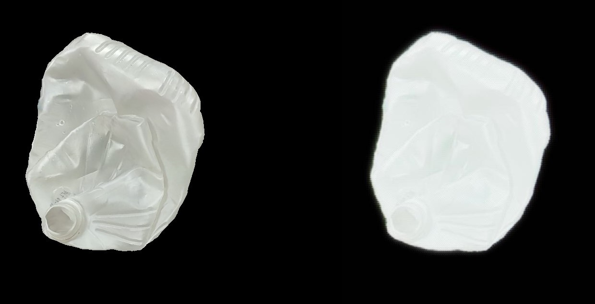

# Autonomous AI-Training for Robot-Assisted Sorting for Efficient Recycling

This project focuses on enhancing the efficiency of recycling processes through the use of advanced AI techniques. Specifically, it implements a CycleGAN model to improve the realism of 3D to 2D model transformations, aiding in the sorting of recyclable materials, such as milk jugs.

## Project Overview

### Objective
The objective of this project is to develop an autonomous AI system that trains robots to assist in sorting recyclable materials more effectively. By using a CycleGAN model, we aim to create more realistic 2D representations of 3D models, facilitating better recognition and sorting accuracy.

### Features
- **CycleGAN Model**: Utilizes a CycleGAN to transform 2D images into more realistic training data.
- **AI-Driven Sorting**: Trains robots to sort recyclable materials with higher precision.
- **Efficiency Improvement**: Aims to streamline recycling processes, reducing waste and improving material recovery rates.

## Getting Started

### Prerequisites
- Python 3.8 or higher
- The following Python libraries:
  - torch==2.0.1+cu118
  - torchvision==0.15.2+cu118
  - numpy==1.24.3
  - PyYAML==6.0
  - typing==3.7.4.3
  - opencv-python==4.7.0.72
  - natsort==8.3.1

### Installation
1. Clone this repository:
   ```sh
   git clone https://github.com/yourusername/robot-assisted-recycling.git
   cd robot-assisted-recycling
